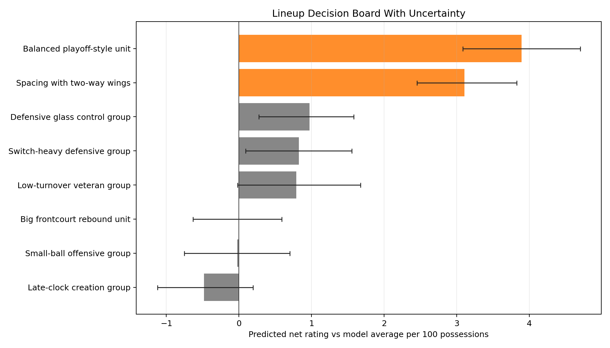
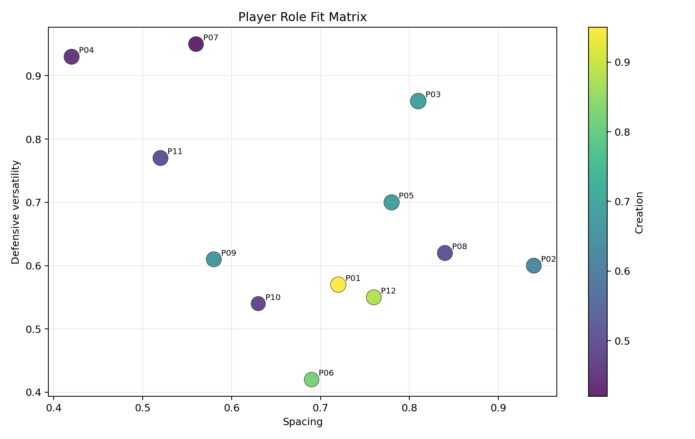
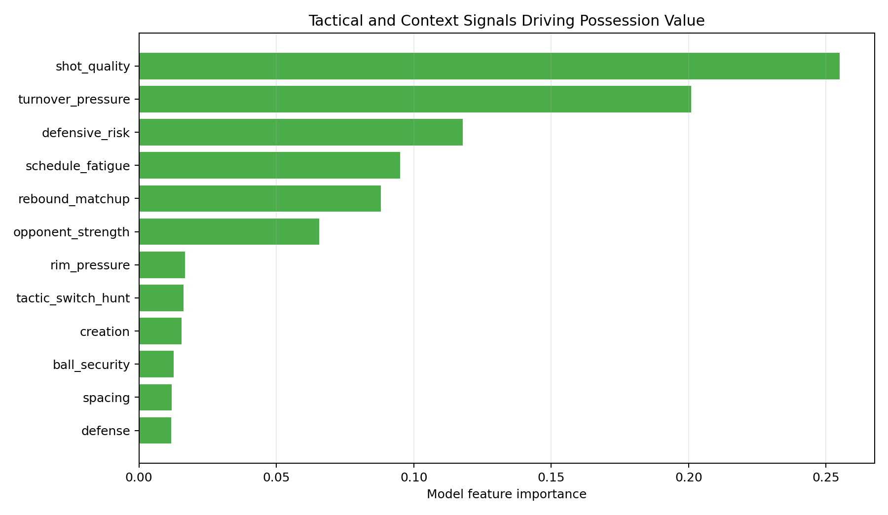

# Basketball Decision-Support Model

Public basketball analytics work sample focused on decision-support modeling, validation, and clear communication to basketball stakeholders.

The project uses synthetic possession-level and player-role data shaped like basketball operations work. It does not use internal team data, scouting grades, tracking data, or proprietary context. The goal is to show the workflow: turn an ambiguous basketball question into a measurable model, validate it, communicate uncertainty, and produce a decision-ready output.

## 90-Second Review

| Area | What this shows |
| --- | --- |
| Basketball question | Which lineup profiles deserve more minutes, matchup review, or caution once efficiency, defensive risk, role fit, tactical context, sample size, and uncertainty are considered together? |
| Modeling approach | Random forest regression for possession value prediction, with a time-based train/test split to reduce leakage. |
| Analytics outputs | Lineup decision board, player role-fit matrix, tactical feature importance, SQL summaries, validation notes, and executive brief. |
| Stakeholder value | Gives coaching, scouting, player development, and strategy teams a shared starting point for film review, lineup testing, and decision discussion. |

## Basketball Question

Which player groups and lineup profiles create the best decision tradeoff once offensive efficiency, defensive risk, sample size, uncertainty, role fit, and tactical context are considered together?

## Visual Outputs







## What This Builds

- Possession-level synthetic dataset across lineups, opponents, game context, and tactical features
- SQL aggregation layer for lineup and player decision tables
- Random forest model for possession value prediction
- Time-based backtest split by game window to reduce leakage
- Uncertainty bands using bootstrap resampling
- Lineup decision board with practical basketball notes
- Player role fit matrix for spacing, creation, defensive versatility, rebounding, and ball security
- Executive brief written for technical and non-technical readers

## Why This Fits Basketball Analytics

Basketball analytics roles often need someone who can evaluate players, teams, lineups, tactics, and decision-making questions without losing the basketball context. This project demonstrates that structure in a small, reviewable package:

- Translates a vague basketball question into a measurable analytical plan
- Treats uncertainty and sample size as part of the recommendation
- Keeps model outputs interpretable for non-technical stakeholders
- Documents assumptions, limitations, and validation checks
- Creates outputs that an engineering or analytics team could productionize later

## Repository Map

| Path | Purpose |
| --- | --- |
| `basketball_decision_model.py` | Generates the synthetic data, trains the model, validates results, and writes outputs. |
| `basketball_decision_queries.sql` | Example SQL summaries for lineup and tactical review. |
| `outputs/lineup_decision_board.csv` | Ranked lineup profiles with sample size, uncertainty, and basketball notes. |
| `outputs/player_role_fit.csv` | Player archetype role-fit table across spacing, creation, defense, rebounding, and ball security. |
| `outputs/model_validation.md` | Train/test split, metrics, interpretation, quality checks, and limitations. |
| `outputs/executive_brief.md` | Plain-language recommendation brief for basketball stakeholders. |

## Run Locally

```bash
pip install -r requirements.txt
python3 basketball_decision_model.py
```

Generated outputs are written to `outputs/`.

## Main Outputs

- `outputs/lineup_decision_board.csv`
- `outputs/player_role_fit.csv`
- `outputs/model_validation.md`
- `outputs/executive_brief.md`
- `outputs/lineup_net_rating_uncertainty.png`
- `outputs/player_role_fit_matrix.png`
- `outputs/tactical_feature_importance.png`

## Result Snapshot

The current run creates 4,428 synthetic possessions and a test-period decision board across 12 lineup profiles.

- Validation MAE: 0.269 points per possession
- Validation RMSE: 0.340 points per possession
- Validation R-squared: 0.052
- Top aggregate tests: balanced playoff-style unit, spacing with two-way wings
- Main decision guardrail: single-possession R-squared is modest by design, so recommendations are made from aggregate ranking, uncertainty bands, sample size, and basketball context notes

## How To Read The Results

This is not meant to predict a single possession perfectly. Basketball possessions are noisy. The useful output is the aggregate view:

- Which lineup profiles look promising enough to test
- Which groups have high defensive or turnover risk
- Which recommendations are still uncertain because of sample size
- Which tactical signals appear most connected to possession value

## Production Extension

With real team data, the same structure would connect to tracking/spatiotemporal data, play-by-play, lineup/personnel data, scouting notes, player availability, possession video tags, and coach-reviewed tactical labels. The production goal would be a repeatable decision workflow, not a one-off notebook.

## Responsible Scope

This repository is a public work sample. It does not claim access to Phoenix Suns internal data or any proprietary basketball dataset. It is designed to demonstrate analytical judgment, reproducible code, honest validation, and stakeholder-ready communication.
